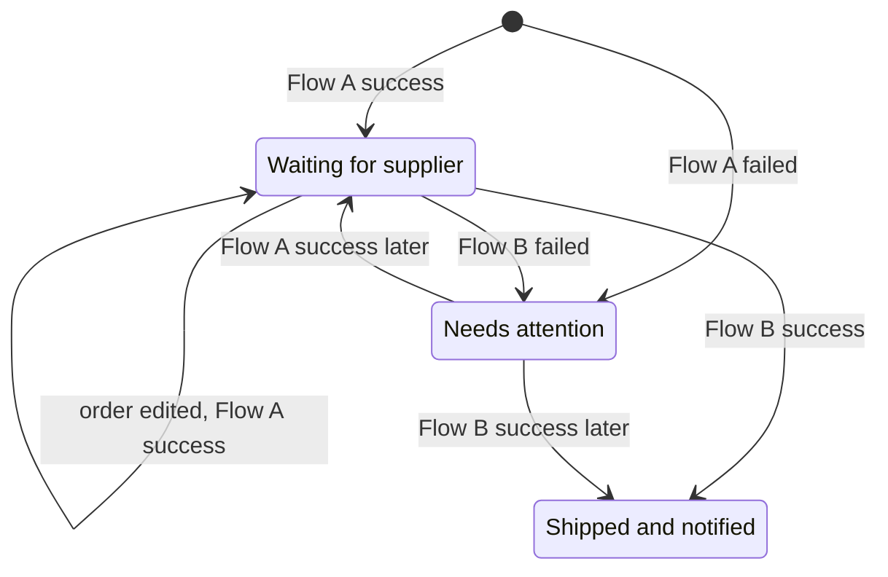
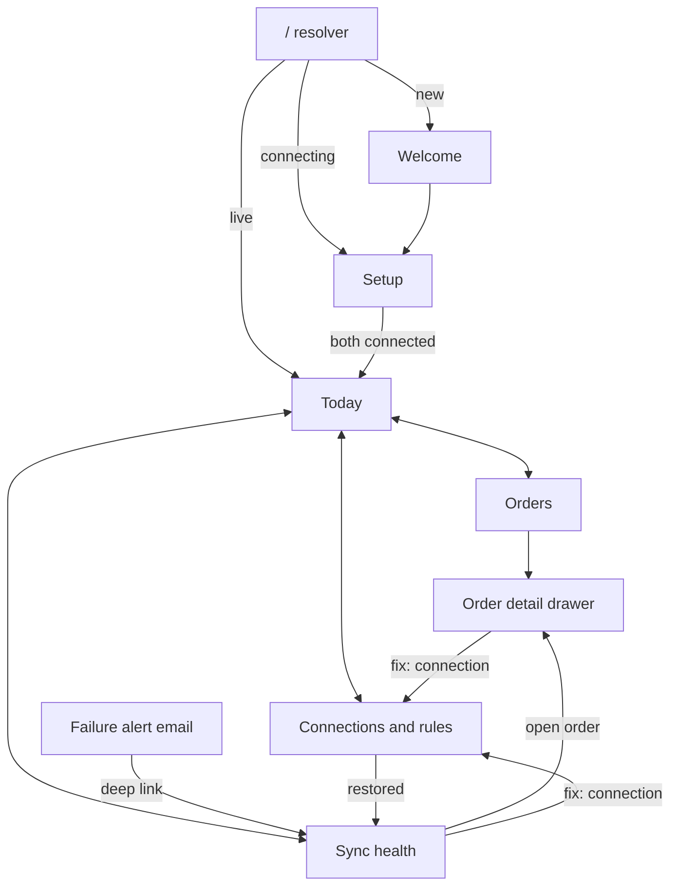
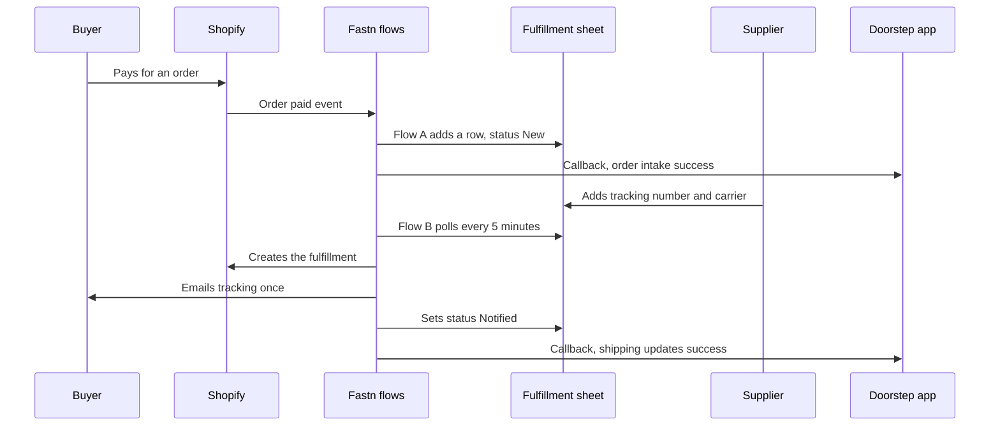

# App flow: Doorstep, movement across the product

2026-09-19 · @Someone

Doorstep is a vertical SaaS for small Shopify merchants who ship through a supplier: this document defines how a merchant, a supplier and a buyer move through three surfaces and four merchant screens, and which of those we build today.

## Product model

Doorstep is vertical because every screen speaks the merchant's language (orders, shipments, issues) and never integration language (workflows, triggers, callbacks). Its one job: every paid order reaches the supplier and every tracking number reaches the buyer, without Sara touching either.

The app is a control tower, not a workspace. Sara does not enter data in it; data entry stays in Shopify and the Fulfillment sheet, which she and her supplier already use.

| In the app | What it means | Backed by |
| --- | --- | --- |
| Order | A paid Shopify order moving through the pipeline | Flow A, `syncEvents` |
| Shipment | An order waiting for, or holding, a tracking number | Sheet columns `tracking_number`, `carrier`; Flow B |
| Connection | Access to Shopify, the sheet or email: Active, Needs reconnect, Not connected | Fastn connections, widget |
| Rule | A setting Sara can change, such as the sheet tab or which order statuses sync | Fastn config |
| Issue | An order that did not move, with the step and reason in plain words | `syncEvents` with outcome failed |
| Order intake | The automation that copies paid orders into the sheet | Flow A |
| Shipping updates | The automation that sends tracking to Shopify and the buyer | Flow B |

**Four design principles.**

- The first screen answers "is anything wrong?" before anything else; when all is well it says so and gets out of the way.
- Every issue carries its own fix: it links to the screen that repairs it.
- The supplier and the buyer never need an account; the sheet and the email are their whole interface.
- Nothing is entered twice: the only writes in our app are connecting accounts and changing rules.

## Surfaces

An order crosses five surfaces, and only one of them is our app; the flow is designed so the other four need no login to Doorstep.

| Surface | Person | How they arrive | What they do there | Where they go next |
| --- | --- | --- | --- | --- |
| Doorstep app | Sara | Bookmark, or the link in a failure alert email | Connect accounts, check Today, review orders and issues, change rules | Shopify admin, the sheet, or the widget inside Connections |
| Fulfillment sheet | Supplier | Sheet link shared by Sara | Reads new rows, fills `tracking_number` and `carrier` | Nowhere; the sheet is the end of their journey |
| Buyer inbox | Buyer | Shopify order confirmation, then one Doorstep tracking email | Reads order number, carrier and tracking link | Carrier tracking page |
| Shopify admin | Sara | "Open in Shopify" on an order, or her own bookmark | Sees the fulfillment appear on the order | Back to Doorstep |
| Fastn widget | Sara | Embedded in Setup and Connections | Connects, reconnects, edits rules | Returns to the screen that opened it |

**Movement rule.** Sara leaves the app only to check evidence (a Shopify order, the sheet) or to repair a connection, and every outbound link opens in a new tab. The widget is an iframe, so connecting and reconnecting never take her off the page.

## Order pipeline

Every order sits in exactly one of three stages, and the stage is derived from the latest callback for that order, so we store nothing new.



Read it top down: an order enters at Waiting or Attention, and only a later success moves it forward.

| Stage | Shown as | Derived from | Sara's next move |
| --- | --- | --- | --- |
| Waiting for supplier | Neutral pill | Latest Flow A event is success and no Flow B success exists | None; the supplier adds tracking |
| Shipped and notified | Green pill | Latest Flow B event is success | None; "Open in Shopify" to check the fulfillment |
| Needs attention | Red pill | Latest event for the order is failed | The fix link on the issue, chosen by error kind |
| Cancelled (P2) | Struck-through pill | Cancel event handled | None |

Skipped events (a test order, or an event already handled) appear in Sync health only. They never create an order in the pipeline.

## Screen map and routes

The app has one entry resolver, two onboarding screens and four screens in the shell; an order detail drawer opens over Orders, and issues link straight to the screen that fixes them.



Read it top down: the resolver decides where Sara lands, the shell has four peers, and every red state has an arrow to its repair.

| Route | Screen | Purpose | Data | Tier |
| --- | --- | --- | --- | --- |
| `/` | Resolver | Sends Sara to the right place for her workspace state | `customers.status`, open issues | 1 |
| `/today` | Today | Answers "is anything wrong?"; shows a setup checklist until live | `syncEvents`, `customers.status` | 1 |
| `/sync-health` | Sync health | Counts and the latest 50 events, issues first | `syncEvents` | 1 |
| `/connections` | Connections and rules | Widget to connect, reconnect and edit rules | Fastn widget | 1 |
| `/orders` | Orders | Pipeline list filtered by stage | `syncEvents` grouped by order | 2 |
| `/orders/:orderId` | Order detail (drawer over Orders) | One order's timeline, Open in Shopify, Open in sheet | `syncEvents` | 2 |
| `/welcome` | Welcome | Creates the workspace and the Fastn customer | `customers` | 3 |
| `/setup` | Setup | Guided Store, then Sheet, then Confirm, using the widget | Widget, `customers.status` | 3 |

**Query parameters.** `?customer=` (demo only, stands in for a session), `?event=<id>` (deep link to one event, opens it expanded), `?stage=` (Orders filter), `?focus=sheet|store|email` (highlights one connection card on Connections).

## Navigation model

The shell has four peer destinations in a fixed order (Today, Orders, Sync health, Connections) and one global status pill that jumps to whichever screen needs Sara most.

- **Wide screens (768 px and up):** a left rail with the four destinations, the workspace name on top.
- **Narrow screens (below 768 px, tested at 360 px):** a bottom tab bar with the same four items, each a 44 px target, and the workspace name and status pill in a top bar.
- **Badge:** Sync health shows the count of open issues; no other item has a badge.
- **Overlay:** the order detail drawer is the only overlay. Closing it returns to the list with filter and scroll kept, because both live in the URL.
- **Back button:** browser back always returns to the previous route; no screen traps it.
- **Outbound links:** Open in Shopify and Open in sheet open in a new tab.
- **Unknown route:** a short "page not found" with one link to Today.

**Status pill.** It is always visible in the header and shows the highest-priority state; a tap goes to the fix.

| Priority | Condition | Pill | Tap goes to |
| --- | --- | --- | --- |
| 1 | A connection is expired or disconnected | Reconnect Google Sheet (or Shopify) | `/connections?focus=sheet` |
| 2 | One or more open issues | 3 need attention | `/sync-health?filter=issues` |
| 3 | Setup not finished | Finish setup | `/connections` (Tier 1), `/setup` (Tier 3) |
| 4 | Live, nothing open | All syncing | `/today` |

## Workspace states and routing

A workspace is in one of five states, and `/` sends Sara to the screen that fits it; only the first two are stored, the rest are derived from `syncEvents`.

| State | How the app knows | `/` lands on | Notes |
| --- | --- | --- | --- |
| New | No `customers` record | `/welcome` | Tier 3; in Tier 1 the demo customer is seeded |
| Connecting | `customers.status` is `connecting` | `/setup` | Tier 1: `/today` with the setup checklist card |
| Live | `customers.status` is `live`, no open issue | `/today` | All-green summary |
| Attention | At least one open issue | `/today` | Issue banner above the summary |
| Reconnect needed | An open issue has `errorKind` connection | `/today` | Reconnect banner outranks the issue banner |

**Open issue.** The latest event for a given customer, order and workflow has outcome failed. A later success for the same triple closes it, so recovery needs no manual clearing.

**Connecting to Live.** Sara presses Confirm on the last setup step once both connections show Active in the widget; the first successful Flow A callback also sets Live. The explicit button exists because we have not yet verified that the widget reports connection status to our page (see open questions).

## Journeys

Five journeys cover every movement in the product; J2 and J3 are the ones the demo video shows.

### J1. First-time setup (Sara)

| Step | Screen | What happens | Moves to |
| --- | --- | --- | --- |
| 1 | `/welcome` | Sara enters shop name and email; we create the `customers` record and the Fastn customer | `/setup` |
| 2 | `/setup`, Store | The widget shows Shopify; Sara connects it and her credentials go to Fastn, not to us | Sheet step, when the card reads Active |
| 3 | `/setup`, Sheet | Sara connects the Fulfillment sheet and confirms the tab | Confirm step |
| 4 | `/setup`, Confirm | Both cards read Active; Sara presses Go live and status becomes `live` | `/today` |
| 5 | `/today` | Empty state: "Waiting for your first order", with Open in Shopify | Stays until the first order |

**Tier 1 shortcut.** Steps 1 to 4 collapse into the checklist card on `/today`, which links to `/connections`; Sara connects both accounts there, presses Confirm, and returns to `/today`.

### J2. Order to shipped (three surfaces)



Read it top down: the buyer and supplier each act once, in surfaces they already use, and the app only observes.

| When | Screen | What Sara sees |
| --- | --- | --- |
| Within 60 s of payment | Today, Orders | The order appears as Waiting for supplier; Today's Received count goes up by one |
| Within 5 min of tracking | Orders | The pill turns to Shipped and notified; Sync health shows two success events for the order |

Sara takes no action in this journey, which is the point of the product.

### J3. Failure to recovery (the deliberate failure in the demo)

| Step | Where | What happens | Moves to |
| --- | --- | --- | --- |
| 1 | `/connections` | Demo only: the presenter disconnects the Google Sheet card, then the supplier adds a tracking number; Flow B fails on its next run | Alert email |
| 2 | Sara's inbox | Alert email: order number, failed step, reason in plain words, one button, Fix it | `/sync-health?event=<id>` |
| 3 | `/sync-health` | The event opens expanded: step "Update sheet row", reason "Google Sheets needs reconnecting"; the primary action is Reconnect Google Sheet | `/connections?focus=sheet` |
| 4 | `/connections` | The sheet card is highlighted and reads Needs reconnect; Sara reconnects in the widget and the card reads Active | Back to `/sync-health`, with a toast: "Google Sheet reconnected. Retrying within 5 minutes." |
| 5 | `/sync-health` | The next Flow B run succeeds, the issue closes, the status pill returns to All syncing | `/orders/:orderId` shows Shipped and notified |

Failures in Flow A (an order that never reached the sheet) recover by replaying the event from Fastn Events; an in-app Retry button is P2 and depends on an open question below.

### J4. Interruptions

| Interruption | What Sara sees | Recovery |
| --- | --- | --- |
| Embed token expires (widget posts `fastn:session-expired`) | The widget area dims for a moment | The app mints a fresh token and reloads the iframe in place; she stays on the same screen |
| Token mint fails | Inline message "Couldn't load your connections" with a Retry button | One tap retries; the rest of the app keeps working |
| Our API is unreachable | A banner "Live updates paused, showing the last data" | Data stays on screen; polling resumes on its own |
| App session expires (production only, Tier 3) | Redirect to sign-in with a return path | She lands back on the screen she was on |

### J5. Return visit

Sara opens the app, `/` reads the workspace state and lands on Today. The top line answers the only question that matters, either "All orders are moving" or "3 orders need attention", and she can be done in under 10 seconds. Anything red is one tap from its fix.

## Screen specs

Each screen has one job and one primary action; the table lists contents top to bottom, so it doubles as the layout brief. Buyer names and addresses are never shown here or stored in MongoDB; they stay in Shopify and the sheet.

| Screen | Contents, top to bottom | Primary action | Empty and error states | Exits |
| --- | --- | --- | --- | --- |
| Today | Status line ("All orders are moving" or "3 orders need attention"); reconnect or issue banner; three counts (Received today, Waiting for supplier, Shipped today); last 5 events; setup checklist card until live | The banner's fix button; none when green | Empty: "Waiting for your first order". Loading: skeleton. API error: banner with last data kept | Sync health, Orders, Connections |
| Orders | Stage filter (All, Waiting, Shipped, Needs attention); rows with order number, stage pill, last update time | Tap a row to open the drawer | Empty per filter, for example "No orders waiting on a supplier" | Order detail drawer |
| Order detail (drawer) | Order number and stage pill; timeline of that order's events in merchant words (Order intake, Shipping updates) with step and reason; Open in Shopify; Open in sheet | Fix, when Needs attention; otherwise Open in Shopify | Order not found: "We have no record of this order" | Connections (fix), Shopify, sheet |
| Sync health | Toggle All or Issues; counts Synced, Skipped, Failed; table of the latest 50 events (time, order, what ran, result, step, reason), issues first; an event opens expanded | Fix on an expanded issue | Empty: "No activity yet". All green: counts only. Paused banner when the API is down | Connections (fix), Order detail |
| Connections and rules | Status strip for Shopify, Google Sheet, Email; the widget iframe; Rules tab for sheet tab and order statuses (Tier 3) | Connect or Reconnect on the highlighted connection | Not connected, Active, Needs reconnect, token expired, widget failed to load with Retry | The screen in `returnTo`, default Today |
| Welcome (Tier 3) | Shop name, email, one button | Create workspace | Email already used: link to the existing workspace | Setup |
| Setup (Tier 3) | A three-step stepper (Store, Sheet, Confirm) with the widget in each step | Continue, then Go live | Step stays until its connection reads Active | Today |
| Failure alert email | Subject "Doorstep: order #1042 needs attention"; what failed in plain words; one button, Fix it | Fix it | Sent once per failing record, never once per attempt | `/sync-health?event=<id>` |
| Buyer tracking email | Shop name, order number, item summary, carrier, tracking link | Track package | Sent once; never resent on retry | Carrier page |
| Supplier sheet | Frozen header row; Doorstep columns grey; `tracking_number` and `carrier` in a highlighted colour labelled "Supplier fills these" | Type a tracking number | Rows with tracking and status New are picked up on the next 5-minute run | None |

The Open in Shopify and Open in sheet links need `shopDomain` and `sheetUrl` on the `customers` record; see contract additions.

## Cross-screen rules

These rules apply to every screen, so they are decided once here rather than per screen.

- **URL is state.** Filters, the open drawer, the expanded event and `returnTo` all live in the URL, so back, reload and shared links behave.
- **Polling.** Sync health and Orders poll `/api/sync-events` every 5 seconds, Today every 15 seconds, and all pause while the tab is hidden; on an error they back off and show the paused banner.
- **Toasts.** One at a time, 5 seconds, only to confirm Sara's own action (for example "Google Sheet reconnected"). Background events use the banner and the status pill, never a toast.
- **Focus.** After a route change focus moves to the screen heading; the drawer traps focus and returns it to the row that opened it.
- **Plain-language reasons.** The app maps the failed step and `errorKind` to a sentence; the raw error sits behind a Details disclosure.
- **Quality floor.** Works at 360 px, visible focus states, reduced motion respected, WCAG AA contrast, 44 px touch targets, and status is never colour alone: every pill carries a word and an icon.
- **Untrusted text.** Callback text renders as text, never as HTML.

| `errorKind` | Sentence shown | Fix link |
| --- | --- | --- |
| `connection` | "Google Sheets needs reconnecting" (or Shopify, or Email) | `/connections?focus=<system>&returnTo=<current>` |
| `data` | "This order has no buyer email, so we could not notify them" | Open in Shopify |
| `other` | "Something went wrong on our side. We will retry automatically." | None; Details shows the step |

## Contract additions

The flow needs three new callback fields and three new customer fields; nothing else in the TRD's data model changes.

```json
{ "customerId": "...", "eventId": "...", "orderId": "...", "orderNumber": "1042",
  "workflow": "orders-to-fulfillment", "outcome": "success | skipped | failed",
  "step": "upsert_row", "errorKind": "connection | data | other", "error": "...",
  "runAt": "2026-09-19T10:41:12Z" }
```

| Where | Field | Why the flow needs it |
| --- | --- | --- |
| Callback and `syncEvents` | `eventId` (unique index) | Deep links to one event; a retried callback cannot double-count |
| Callback and `syncEvents` | `orderNumber` | Orders list, drawer heading and alert email show "#1042", not an internal id |
| Callback and `syncEvents` | `errorKind` | Chooses the plain sentence and the fix link |
| `customers` | `status`: `new`, `connecting`, `live` | The only stored workspace state |
| `customers` | `shopDomain` | Open in Shopify (Tier 2) |
| `customers` | `sheetUrl` | Open in sheet (Tier 2) |

**Derivation rules (no new collection).**

- Order stage: if the latest event for any workflow on that order failed, Needs attention; otherwise if a Flow B success exists, Shipped and notified; otherwise Waiting for supplier.
- Open issue: the latest event for a customer, order and workflow has outcome failed.
- `errorKind` is set inside each flow's catch step: authorization or expired-token errors are `connection`, a missing buyer email or address is `data`, everything else is `other`.

**Alert email.** The flow's catch step sends the merchant alert through the email connector once per failing record (a state key stops repeats across attempts), building the Fix it link from the app base URL in `fastn.envConfig`. Fastn's own failure alert stays on as the operator-side alert.

## Build tiers and flow tests

Today we build Tier 1 only until the Fastn flows pass T1 to T9; Tiers 2 and 3 are added in order if time remains, and each tier is a complete, demoable product on its own.

| Tier | Ships | Done when | Cut line |
| --- | --- | --- | --- |
| 1 | App shell with nav and status pill, Sync health, Connections with `focus` and `returnTo`, minimal Today (status line, counts, checklist card), callback receiver with the new fields, alert email deep link | J3 runs end to end and the video can be recorded | Never cut |
| 2 | Orders list, order detail drawer, `shopDomain` and `sheetUrl` | J2 is visible as stage changes | Cut first |
| 3 | Welcome, Setup stepper, Rules tab, sign-in | J1 runs without a seeded customer | Cut second |

**Build order inside Tier 1:** the hardest screen first (Sync health with its failure state), then empty and error states for it, then Connections, and Today last because it only summarises the other two.

**Navigation acceptance tests** (added to the PRD's T1 to T9 and run against the demo workspace).

| # | Test | Pass condition |
| --- | --- | --- |
| N1 | Open `/today` with one failed event stored | The banner and the status pill show the issue; the pill opens `/sync-health?filter=issues` |
| N2 | Open `/sync-health?event=<id>` cold, from the alert email | That event is already expanded with its reason and a Fix button |
| N3 | Tap Fix on a connection issue | `/connections?focus=sheet` opens with the sheet card highlighted; after reconnecting, the app returns to `/sync-health` with a toast |
| N4 | Let the next Flow B run succeed | The issue closes with no manual action and the pill reads All syncing |
| N5 | Post the same callback twice | One event is stored; counts do not double |
| N6 | Use the app at 360 px and by keyboard only | All four destinations reachable, 44 px targets, focus visible, Fix reachable without a mouse |
| N7 | Let the embed token expire | The widget reloads in place and Sara stays on Connections |

## Demo path

The 2-minute video shows one continuous walk across all three surfaces, with the deliberate failure as the last beat, so a judge sees the movement rather than a feature list.

| Time | Shot | Screens and surfaces | Movement shown |
| --- | --- | --- | --- |
| 0:00 to 0:20 | Sara's bad day | Shopify admin, the sheet with manual copying | The problem, then a cut to Doorstep Today |
| 0:20 to 0:40 | Connect | Today checklist, Connections with the widget, back to Today | Store and sheet connect; Today reads "Waiting for your first order" |
| 0:40 to 1:10 | Order arrives | Shopify checkout, the sheet, Today | A row appears in the sheet within 60 s and Today's Received count goes up |
| 1:10 to 1:40 | Tracking goes out | Supplier types in the sheet, Shopify fulfillment, buyer inbox, Sync health | Fulfillment and one email appear; Sync health shows two successes |
| 1:40 to 2:00 | Failure and fix | Alert email, Sync health, Connections, Sync health | J3 compressed: the issue opens, the sheet reconnects, the issue closes |

Flow B polls every 5 minutes, so run it on demand with `trigger_scheduler_now` for the two Flow B beats and say so in the voiceover. If Tier 2 ships, the 1:10 beat also shows the Orders pill turning to Shipped and notified.

## Open questions to verify

- [ ] Does the widget post connection-status events to our page, or must the server read connection state from Fastn per customer? Until known, the Confirm button and the widget's own status display carry the flow.
- [ ] Can the widget open on a specific connection, or is `focus` only our highlight around it?
- [ ] Can our server start a Flow A replay through Fastn's execute API, so a Retry button can exist (P2)?
- [ ] Which email connector sends the merchant alert, and can its body carry a button link to our app?
