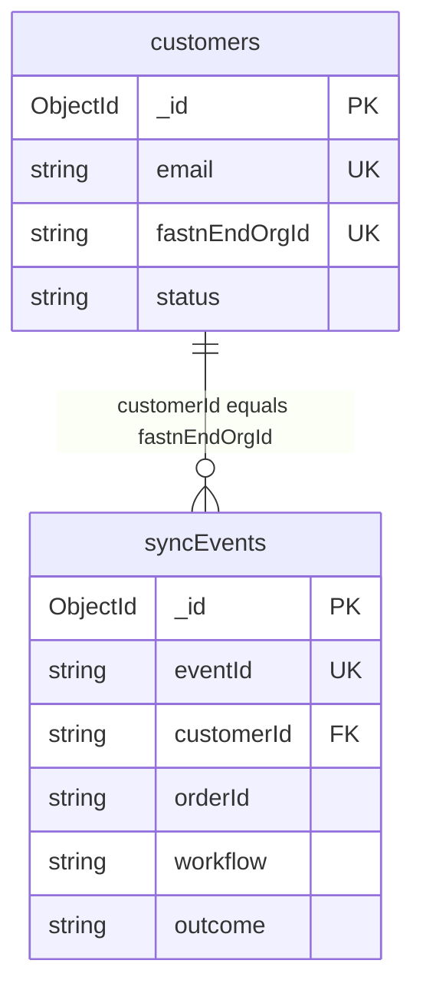

# Backend schema: Doorstep data, APIs and derived views

2026-09-19 · @Someone

Doorstep keeps only two collections in MongoDB (`customers` and `syncEvents`); orders and buyer data stay in Shopify and the sheet, and idempotency stays in `fastn.state`. This document defines every store, field, index, endpoint and derived query the app flow needs.

## Data ownership

Every piece of data has one home, chosen so that buyer personal data never enters our database and anything the workflow sandbox must read stays inside Fastn.

| Data | Home | Written by | Buyer personal data |
| --- | --- | --- | --- |
| Merchant profile, links, setup status | MongoDB `customers` | Host app | No (the merchant's own name and email) |
| Sync outcomes and failures | MongoDB `syncEvents` | Callback receiver | No |
| Buyer name, email, phone, address, items | Shopify and the Fulfillment sheet | Shopify, then Flow A | Yes |
| Tracking number and carrier | Fulfillment sheet, then the Shopify fulfillment | Supplier, then Flow B | No |
| Idempotency, notified and alert keys | `fastn.state` | Flow A, Flow B | No |
| Merchant rules | Fastn config | Widget | No |
| Credentials and secrets | Fastn connections and `fastn.secrets` | Fastn | Never in our stores |
| Order stage, open issues, counts | Computed at read time from `syncEvents` | Host app API | No |

**Identity rule.** `customerId` means the Fastn end-org id (a UUID) in every store: the callback, `syncEvents` and the state keys. `customers._id` is our internal id and never leaves MongoDB, so there is one name for one thing everywhere the flows and the host app meet.



Read it as: one customer has many events, joined on the Fastn id rather than on `_id`.

## Collection: customers

One document per merchant; it holds the map from our merchant to the Fastn customer, the setup status, and the two links the app needs to open Shopify and the sheet.

| Field | Type | Required | Rules | Set by |
| --- | --- | --- | --- | --- |
| `_id` | ObjectId | Yes | Automatic; internal only | MongoDB |
| `name` | string | Yes | 1 to 80 characters, trimmed | Welcome, or the seed |
| `email` | string | Yes | Lowercased, valid format, up to 254 characters, unique | Welcome, or the seed |
| `fastnEndOrgId` | string | Yes | UUID of the Fastn customer, unique | Server, after it creates the Fastn customer |
| `status` | enum | Yes | `new`, `connecting` or `live`; default `new` | Host app |
| `shopDomain` | string or null | No | Matches `name.myshopify.com` | Setup step |
| `sheetUrl` | string or null | No | Starts with `https://docs.google.com/spreadsheets/d/` | Setup step |
| `timezone` | string | Yes | IANA name; default `Asia/Karachi` for the demo store | Welcome, or the seed |
| `liveAt` | date or null | No | Set once, when status first becomes `live` | Host app |
| `createdAt`, `updatedAt` | date | Yes | UTC | Host app |

**Status transitions.** Status only moves forward; "reconnect needed" is derived from events and never stored.

| From | To | Trigger |
| --- | --- | --- |
| `new` | `connecting` | First call to `/api/fastn-token` for this merchant |
| `connecting` | `live` | Sara presses Confirm, or the first successful Flow A callback arrives |

**Indexes.** Unique on `email`; unique on `fastnEndOrgId` (this is also the lookup the callback receiver uses on every event).

```json
{ "_id": "66f1c0a2b7e4d9a1c3e5f701", "name": "Sara's Threads", "email": "sara@example.com",
  "fastnEndOrgId": "8d3c1f52-6b0e-4c1a-9a57-2f4e8b6d0c13", "status": "live",
  "shopDomain": "saras-threads.myshopify.com", "sheetUrl": "https://docs.google.com/spreadsheets/d/1AbC...",
  "timezone": "Asia/Karachi", "liveAt": "2026-09-19T08:12:44Z",
  "createdAt": "2026-09-19T07:58:01Z", "updatedAt": "2026-09-19T08:12:44Z" }
```

## Collection: syncEvents

An append-only log with one document per flow outcome; documents are never updated, and an issue "closing" is derived from a later success rather than written.

| Field | Type | Required | Rules |
| --- | --- | --- | --- |
| `_id` | ObjectId | Yes | Automatic; breaks ties when two events share `at` |
| `eventId` | string | Yes | 1 to 128 characters of `A-Z a-z 0-9 : _ -`; built by the flow from order id, workflow and run time; unique |
| `customerId` | string | Yes | Fastn end-org id (UUID); must match a `customers.fastnEndOrgId` |
| `orderId` | string | Yes | Shopify numeric order id, digits only, up to 20 characters |
| `orderNumber` | string or null | No | Human number such as `1042`, up to 32 characters |
| `workflow` | enum | Yes | `orders-to-fulfillment` or `tracking-to-shopify-and-buyer` |
| `outcome` | enum | Yes | `success`, `skipped` or `failed` |
| `step` | enum | Yes | One of the closed step names in the vocabulary section |
| `errorKind` | enum or null | When failed | `connection`, `data` or `other`; null unless `outcome` is `failed` |
| `error` | string or null | When failed | Up to 500 characters, sanitised; null unless `outcome` is `failed` |
| `at` | date | Yes | Run time reported by the flow if within 24 hours before and 5 minutes after receipt; otherwise `receivedAt` |
| `receivedAt` | date | Yes | Server time on receipt, UTC |

| Index | Serves | Options |
| --- | --- | --- |
| `{ eventId: 1 }` | Duplicate detection on the callback | Unique |
| `{ customerId: 1, at: -1 }` | Sync health feed and counts | None |
| `{ customerId: 1, orderId: 1, workflow: 1, at: -1 }` | Order stage and open issues | None |
| `{ at: 1 }` | Retention | TTL, 30 days (`expireAfterSeconds: 2592000`) |

**Retention effect.** After 30 days an event disappears, so an order older than that leaves the Orders list; Sync health and Today only look at recent windows and are unaffected.

```json
{ "eventId": "5551234567890:tracking-to-shopify-and-buyer:1758276072",
  "customerId": "8d3c1f52-6b0e-4c1a-9a57-2f4e8b6d0c13", "orderId": "5551234567890",
  "orderNumber": "1042", "workflow": "tracking-to-shopify-and-buyer",
  "outcome": "failed", "step": "update_status", "errorKind": "connection",
  "error": "401 invalid_grant", "at": "2026-09-19T10:41:12Z", "receivedAt": "2026-09-19T10:41:13Z" }
```

## Validators and init script

MongoDB enforces shape and enums with a `$jsonSchema` validator, and the receiver enforces the one rule the validator cannot express: a `failed` event must carry `errorKind` and `error`, and every other outcome must carry neither. Run this once per environment (mongosh).

```javascript
const UUID = "^[0-9a-f]{8}-[0-9a-f]{4}-[0-9a-f]{4}-[0-9a-f]{4}-[0-9a-f]{12}$";

db.createCollection("customers", { validator: { $jsonSchema: {
  bsonType: "object", additionalProperties: false,
  required: ["name","email","fastnEndOrgId","status","timezone","createdAt","updatedAt"],
  properties: {
    _id: { bsonType: "objectId" },
    name: { bsonType: "string", minLength: 1, maxLength: 80 },
    email: { bsonType: "string", maxLength: 254, pattern: "^[^@\\s]+@[^@\\s]+\\.[^@\\s]+$" },
    fastnEndOrgId: { bsonType: "string", pattern: UUID },
    status: { enum: ["new","connecting","live"] },
    shopDomain: { bsonType: ["string","null"], pattern: "^[a-z0-9][a-z0-9-]*\\.myshopify\\.com$" },
    sheetUrl: { bsonType: ["string","null"], pattern: "^https://docs\\.google\\.com/spreadsheets/d/[A-Za-z0-9_-]+" },
    timezone: { bsonType: "string", maxLength: 64 },
    liveAt: { bsonType: ["date","null"] },
    createdAt: { bsonType: "date" }, updatedAt: { bsonType: "date" }
  } } } });
db.customers.createIndex({ email: 1 }, { unique: true });
db.customers.createIndex({ fastnEndOrgId: 1 }, { unique: true });

db.createCollection("syncEvents", { validator: { $jsonSchema: {
  bsonType: "object", additionalProperties: false,
  required: ["eventId","customerId","orderId","workflow","outcome","step","at","receivedAt"],
  properties: {
    _id: { bsonType: "objectId" },
    eventId: { bsonType: "string", minLength: 1, maxLength: 128, pattern: "^[A-Za-z0-9:_-]+$" },
    customerId: { bsonType: "string", pattern: UUID },
    orderId: { bsonType: "string", pattern: "^[0-9]{1,20}$" },
    orderNumber: { bsonType: ["string","null"], maxLength: 32 },
    workflow: { enum: ["orders-to-fulfillment","tracking-to-shopify-and-buyer"] },
    outcome: { enum: ["success","skipped","failed"] },
    step: { enum: ["read_order","apply_conditions","dedupe_check","upsert_row","read_rows",
                   "create_fulfillment","send_buyer_email","update_status","send_alert"] },
    errorKind: { enum: ["connection","data","other",null] },
    error: { bsonType: ["string","null"], maxLength: 500 },
    at: { bsonType: "date" }, receivedAt: { bsonType: "date" }
  } } } });
db.syncEvents.createIndex({ eventId: 1 }, { unique: true });
db.syncEvents.createIndex({ customerId: 1, at: -1 });
db.syncEvents.createIndex({ customerId: 1, orderId: 1, workflow: 1, at: -1 });
db.syncEvents.createIndex({ at: 1 }, { expireAfterSeconds: 2592000 });
```

**Seed.** Insert one `customers` document for the demo store with `status: "connecting"` and the Fastn customer UUID created in the workspace; the demo passes its id as `?customer=`.

## Closed vocabularies

The flows and the app share a fixed set of names, so the app can turn any event into a merchant-language sentence and a fix link without parsing free text; a flow that emits a name outside these lists is rejected by the receiver.

| Workflow slug | Merchant label | Purpose |
| --- | --- | --- |
| `orders-to-fulfillment` | Order intake | Flow A: paid order to sheet row |
| `tracking-to-shopify-and-buyer` | Shipping updates | Flow B: tracking to Shopify fulfillment and buyer email |

| Step | System | Used by | Plain label |
| --- | --- | --- | --- |
| `read_order` | Shopify | A | Reading the order |
| `apply_conditions` | None | A | Checking the order rules |
| `dedupe_check` | None | A, B | Checking it was not already handled |
| `upsert_row` | Google Sheets | A | Adding the order to the sheet |
| `read_rows` | Google Sheets | B | Reading tracking numbers |
| `create_fulfillment` | Shopify | B | Creating the Shopify fulfillment |
| `send_buyer_email` | Email | B | Emailing the buyer |
| `update_status` | Google Sheets | B | Marking the row Notified |
| `send_alert` | Email | A, B | Sending the failure alert |

**Outcomes.** `success` means the step's work is done; `skipped` means nothing needed doing, at `apply_conditions` (a test or unpaid order) or `dedupe_check` (already handled); `failed` means the record did not move.

**Error kinds.** `connection`: authorization failed, a token expired or access was revoked, and the fix is to reconnect. `data`: the order lacks something the flow needs, and the fix is in Shopify. `other`: anything else, retried automatically.

| `errorKind` | `step` | Sentence shown to Sara |
| --- | --- | --- |
| `connection` | Any step with a system | "{System} needs reconnecting" |
| `data` | `send_buyer_email` | "This order has no buyer email, so we could not notify them" |
| `data` | `upsert_row` | "This order is missing information the sheet needs" |
| `data` | Any other | "This order is missing information we need" |
| `other` | Any | "Something went wrong on our side. We will retry automatically." |

A failure at `send_alert` is stored like any other event but cannot trigger an alert of its own, so it appears in Sync health only.

## Derived views

Order stage, open issues and counts are computed on read from `syncEvents`, so the app flow needs no extra collection; all three build on one base step, the latest success-or-failure per order and workflow. Skipped events are excluded so a skip can never create an order or close an issue.

```javascript
const A = "orders-to-fulfillment", B = "tracking-to-shopify-and-buyer";

const latestPerOrderWorkflow = (customerId) => [
  { $match: { customerId, outcome: { $in: ["success", "failed"] } } },
  { $sort: { at: -1, _id: -1 } },
  { $group: {
      _id: { orderId: "$orderId", workflow: "$workflow" },
      eventId: { $first: "$eventId" }, outcome: { $first: "$outcome" },
      step: { $first: "$step" }, errorKind: { $first: "$errorKind" },
      error: { $first: "$error" }, at: { $first: "$at" },
      orderNumber: { $max: "$orderNumber" },
      everSucceeded: { $max: { $eq: ["$outcome", "success"] } } } }
];

// Open issues: the latest event for an order and workflow is a failure
const openIssues = (customerId) => [
  ...latestPerOrderWorkflow(customerId),
  { $match: { outcome: "failed" } }, { $sort: { at: -1 } }, { $limit: 50 }
];

// Orders with a stage (Tier 2)
const orders = (customerId) => [
  ...latestPerOrderWorkflow(customerId),
  { $group: { _id: "$_id.orderId",
      orderNumber: { $max: "$orderNumber" }, lastEventAt: { $max: "$at" },
      needsAttention: { $max: { $eq: ["$outcome", "failed"] } },
      shipped: { $max: { $and: [{ $eq: ["$_id.workflow", B] }, "$everSucceeded"] } } } },
  { $addFields: { stage: { $switch: { branches: [
      { case: "$needsAttention", then: "needs_attention" },
      { case: "$shipped", then: "shipped" } ], default: "waiting" } } } },
  { $sort: { lastEventAt: -1 } }, { $limit: 100 }
];

// Sync health counts over a window; failed counts distinct order and workflow pairs
const counts = (customerId, since) => [
  { $match: { customerId, at: { $gte: since } } },
  { $facet: {
      byOutcome: [ { $match: { outcome: { $in: ["success", "skipped"] } } },
                   { $group: { _id: "$outcome", n: { $sum: 1 } } } ],
      failed: [ { $match: { outcome: "failed" } },
                { $group: { _id: { o: "$orderId", w: "$workflow" } } }, { $count: "n" } ] } }
];
```

**Why failed counts distinct pairs.** A flow can report a failure on every retry attempt, so counting events would show one broken order as three failures.

**Today's counts.** Received today is the number of distinct `orderId` values with a Flow A success since local midnight; Shipped today is the same for Flow B; Waiting for supplier is the `waiting` count from the orders view. Local midnight comes from `customers.timezone`, computed in Node before the query.

```javascript
function workspaceState(customer, issues) {
  if (customer.status === "new") return { state: "new" };
  if (customer.status === "connecting") return { state: "connecting" };
  const conn = issues.find((i) => i.errorKind === "connection");
  if (conn) return { state: "reconnect_needed", system: SYSTEM_BY_STEP[conn.step] };
  return issues.length ? { state: "attention" } : { state: "live" };
}
```

The indexes in the `syncEvents` section cover all of these; at demo volume (hundreds of events) each view is a single fast query.

## API contracts

Nine endpoints serve the app flow; every browser endpoint first passes through one `loadCustomer` middleware that resolves the merchant (a session in production, a validated `?customer=` id in the demo) and hands the handlers `customer.fastnEndOrgId`, so no handler reads a customer id from the request body.

| Endpoint | Caller | Auth | Success | Errors |
| --- | --- | --- | --- | --- |
| `POST /api/sync-events` | Fastn flows | `x-callback-secret` header | 201 stored, 200 duplicate | 400 invalid, 401 secret, 404 unknown customer, 413 too large, 429 rate limit |
| `GET /api/sync-events` | Browser | Session | 200 feed and counts | 400 invalid query, 404 |
| `GET /api/workspace` | Browser | Session | 200 state and Today counts | 404 |
| `POST /api/workspace` | Browser | Session | 200 updated | 400 invalid, 404 |
| `GET /api/fastn-token` | Browser | Session | 200 iframe URL | 502 Fastn token API failed |
| `GET /api/orders` (Tier 2) | Browser | Session | 200 list | 400 invalid stage |
| `GET /api/orders/:orderId` (Tier 2) | Browser | Session | 200 timeline | 404 |
| `POST /api/customers` (Tier 3) | Browser | None yet | 201 created | 409 email exists, 502 Fastn customer failed |
| `GET /api/health` | Monitor | None | 200 with a MongoDB ping | 503 |

### Callback: POST /api/sync-events

The body is strict: unknown fields are rejected, and `runAt` is the flow's own run time.

```json
{ "customerId": "8d3c1f52-6b0e-4c1a-9a57-2f4e8b6d0c13",
  "eventId": "5551234567890:tracking-to-shopify-and-buyer:1758276072",
  "orderId": "5551234567890", "orderNumber": "1042",
  "workflow": "tracking-to-shopify-and-buyer", "outcome": "failed",
  "step": "update_status", "errorKind": "connection", "error": "401 invalid_grant",
  "runAt": "2026-09-19T10:41:12Z" }
```

The receiver runs these steps in order, and stops at the first that fails:

1. Compare the secret in constant time.
2. Validate the body against the same rules as the collection validator, plus the failed-event rule.
3. Sanitise `error`: cut to 500 characters, redact email addresses and long digit runs, strip control characters.
4. Look up `customers` by `fastnEndOrgId`; no match is a 404.
5. Set `at` to `runAt` if it falls within 24 hours before to 5 minutes after now, otherwise to the receive time; set `receivedAt` to now.
6. Insert; a duplicate `eventId` returns 200 with `{ "duplicate": true }` and changes nothing.
7. If the event is a Flow A success and the customer is not yet `live`, set `status: "live"` and `liveAt`.

### Feed: GET /api/sync-events

| Query | Rule | Default |
| --- | --- | --- |
| `customer` | Demo only; 24-character hex ObjectId | Session |
| `filter` | `issues` or absent | All events |
| `event` | An `eventId`; that event is always included | None |
| `limit` | Integer 1 to 50 | 50 |
| `sinceHours` | Integer 1 to 168, window for the counts | 24 |

The events list is the union of open issues and the latest `limit` events, de-duplicated by `eventId`, open issues first, then newest first, cut to `limit`.

```json
{ "counts": { "synced": 42, "skipped": 3, "failed": 1, "sinceHours": 24 },
  "openIssueCount": 1,
  "events": [ { "eventId": "...", "orderId": "5551234567890", "orderNumber": "1042",
    "workflow": "tracking-to-shopify-and-buyer", "label": "Shipping updates",
    "outcome": "failed", "step": "update_status", "system": "sheet", "errorKind": "connection",
    "reason": "Google Sheets needs reconnecting", "error": "401 invalid_grant",
    "at": "2026-09-19T10:41:12Z", "open": true } ] }
```

### Workspace: GET and POST /api/workspace

The status pill, the Today screen and the setup checklist all read this one response.

```json
{ "name": "Sara's Threads", "status": "live", "state": "reconnect_needed",
  "reconnectSystem": "sheet", "openIssueCount": 1,
  "shopDomain": "saras-threads.myshopify.com", "sheetUrl": "https://docs.google.com/spreadsheets/d/1AbC...",
  "today": { "received": 3, "waiting": 1, "shipped": 2 } }
```

`POST /api/workspace` takes either `{ "action": "confirm_setup" }`, which sets `live`, or `{ "shopDomain": "...", "sheetUrl": "..." }` with the same rules as the `customers` validator; anything else is a 400.

### Token, orders and customers

- `GET /api/fastn-token` mints the embed token as in the TRD and returns `{ "url": "..." }`; the first call moves `new` to `connecting`.
- `GET /api/orders?stage=waiting|shipped|needs_attention` returns `{ "orders": [ { "orderId", "orderNumber", "stage", "lastEventAt" } ] }`; `GET /api/orders/:orderId` returns the same header plus `timeline`, that order's events oldest first in the feed's event shape.
- `POST /api/customers` (Tier 3) looks the email up first, creates the Fastn customer only if none exists, then inserts, so a retry after a partial failure cannot create two Fastn customers.

## Fastn-side stores

The workflow sandbox cannot reach MongoDB, so everything a flow must read while it runs lives in Fastn: the idempotency keys in `fastn.state`, and the merchant's rules and alert address in the config template.

| State key | Written by | Value | Written when | Purpose |
| --- | --- | --- | --- | --- |
| `orders-to-fulfillment:{customerId}:{orderId}` | Flow A | `{ rowId, hash, status, processedAt }` | After the sheet write | Skip replays, detect edited orders |
| `tracking-notify:{customerId}:{orderId}` | Flow B | `{ notifiedAt, trackingNumber }` | After the email is sent, before the sheet status | Never email a buyer twice |
| `alert:{customerId}:{orderId}:{workflow}` | Flow A, Flow B | `{ sentAt, clearedAt }` | After the alert email | One alert per failing record |

**State rules.** `{customerId}` is the Fastn end-org id read from `ctx.headers['x-end-org-id']`. State is written after the side effect, never before. An alert may be sent when its key is missing or has `clearedAt`; the next success for that order and workflow sets `clearedAt`, so a later, different failure alerts again. Values stay under 1 KB and hold no buyer personal data (`hash` is computed from order fields and cannot be reversed to them).

**Config template** (one template, cloned per merchant, read with `fastn.config.getByTemplate`):

```json
{ "orderFilter": { "financialStatus": ["paid"], "excludeTestOrders": true },
  "sheet": { "tab": "Fulfillment" },
  "statuses": { "new": "New", "notified": "Notified" },
  "alertEmail": "sara@example.com" }
```

`alertEmail` sits in config because the flow cannot read `customers.email`; the server writes it when it creates the merchant's config. The exact field shapes come from the approved config page and override this sketch.

| Where | Name | Holds |
| --- | --- | --- |
| `fastn.envConfig` | `appBaseUrl` | Base URL of the host app, used for the callback and the Fix it link |
| `fastn.secrets` | `callbackSecret` | The value the receiver compares with `x-callback-secret` |

## Fulfillment sheet schema

The sheet is the supplier's whole interface and the only place Flow B reads tracking from, so its columns are a contract: Flow A writes the order columns, and the supplier fills only `tracking_number` and `carrier`.

| Column | Set by | Format and rules |
| --- | --- | --- |
| `order_id` | Flow A | Shopify numeric id as text; the upsert key; never edited |
| `order_number` | Flow A | Text such as `1042` |
| `created_at` | Flow A | ISO 8601, UTC |
| `buyer_name` | Flow A | Text |
| `buyer_email` | Flow A | Text; if empty the row is still written, and Flow B later fails it as `data` |
| `buyer_phone` | Flow A | Text format, so a leading `+` or zero survives |
| `ship_address` | Flow A | One cell, address lines joined with a comma |
| `items` | Flow A | One line per item with SKU, size and quantity separated by slashes, for example `TS-101 / M / x2`; lines separated by a line break |
| `status` | Flow A, Flow B | `New` or `Notified` (`Cancelled` is P2); dropdown validation in the template |
| `tracking_number` | Supplier | 6 to 40 letters, digits or hyphens, text format; Flow B trims it |
| `carrier` | Supplier | Dropdown from the template's list |
| `notified_at` | Flow B | ISO 8601, UTC, written together with `status` |

**Sheet rules.**

- Row 1 is the header and its names are exact; the flows find columns by header name, not by position.
- One tab per merchant, named in config (`sheet.tab`).
- The identity of a row is `order_id`. Sheets has no unique constraint, so Flow A looks the row up first and updates it if it exists, which is what keeps replays and edits from creating duplicates.
- Flow B picks up a row when `tracking_number` is not empty and `status` is not `Notified`.
- A malformed tracking number is reported as a `data` failure and the row is left untouched for the supplier to correct.
- The template colours the two supplier columns and sets warning-only protection on the rest, so the supplier is guided but Flow A can still write.

## Integrity, security and privacy rules

These rules are the backend's acceptance criteria for requirements R3 to R5; each one is testable.

- **Tenant isolation.** Every `syncEvents` query takes `customerId` from the resolved customer, never from the request body or query string. In the demo, `?customer=` must parse as an ObjectId and match a `customers` document before anything else runs.
- **Typed input only.** Each parameter is parsed to its exact type (an allow-listed string, a pattern-checked string, or an integer in range); arrays and objects are rejected, so input such as `filter[$ne]=x` can never reach MongoDB as an operator. Pipelines are built from parsed values only.
- **Callback trust.** Constant-time secret comparison, a 100 KB body limit, a route-level rate limit and a strict schema; the secret is never logged.
- **Safe redelivery.** Delivery is at least once, and the unique `eventId` index makes a repeated callback a no-op.
- **Out-of-order arrival.** The latest event by `at` wins, so a delayed older failure carrying an earlier `runAt` cannot overwrite a newer success; ties break on `_id`.
- **Privacy.** MongoDB holds no buyer name, email, phone or address; the only personal data we store is the merchant's own name and email. Flows must not put buyer data in `error`, and the receiver redacts email addresses and long digit runs as a second guard.
- **Output.** `error` is shown only inside Details, and all stored text renders as text, never as HTML.
- **Write ownership.** Only the receiver writes `syncEvents`, and no endpoint updates or deletes an event; only the workspace, token and customers endpoints write `customers`.
- **Time.** All timestamps are UTC; local time appears only when Node computes "today" from `customers.timezone`.
- **Retention and recovery.** `syncEvents` expires after 30 days; a lost event is recoverable from Fastn's execution history, which stays the source of truth for what ran.
- **Secrets.** The MongoDB URI and the Fastn API key live in server environment variables only.

## Decisions, changes and open questions

Where the TRD and this document differ on a field, this document wins; the changes below are the differences.

| Change | Why |
| --- | --- |
| `customers` gains `timezone`, `liveAt` and `updatedAt` | "Today" needs a time zone; `liveAt` records when setup finished |
| `syncEvents` gains `receivedAt` and a fourth index on `customerId`, `orderId`, `workflow`, `at` | Trustworthy ordering, and the derived views |
| The callback gains `runAt`, alongside `eventId`, `orderNumber` and `errorKind` from the App flow document | Lets `at` reflect when the flow ran, not when the callback arrived |
| Step names are a closed set; the example step `append_row` becomes `upsert_row` | The app maps steps to systems and sentences |
| New state key `alert:{customerId}:{orderId}:{workflow}` and `alertEmail` in config | One alert per failing record; the flow cannot read `customers.email` |
| Failed counts are distinct order and workflow pairs | Retries would otherwise inflate one failure into three |
| `GET /api/workspace` also returns Today's counts | One poll feeds the pill, Today and the checklist |

**Open questions to verify against the real connectors.**

- [ ] Is the Shopify order id numeric in the connector payload, or a global id that the flow must strip? The validator assumes digits.
- [ ] Can a flow overwrite a `fastn.state` key? The alert reset depends on it.
- [ ] Does `ctx` expose the retry attempt number or an execution id? If so, alerts and failed events can fire after the last attempt and `eventId` can use the execution id.
- [ ] Which email connector sends the alert, and can its body carry a link?
