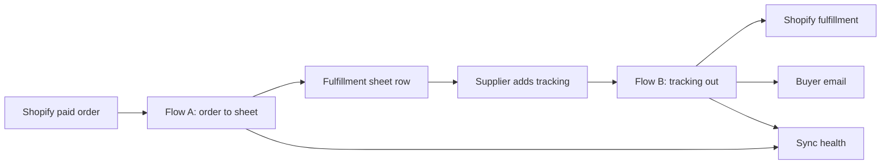

# PRD: Doorstep, order-to-doorstep autopilot for small merchants

2026-09-19 · @Someone

## Overview

Doorstep moves a small merchant's paid Shopify orders into their fulfillment sheet, sends tracking back to Shopify and the buyer, and shows every failure instead of hiding it. It is our entry for Track 02 (Ecommerce Inventory and Order Sync) of Build with Fastn on 19 September 2026 at SEECS NUST, built on Fastn connectors, workflows, triggers and the embedded widget.

**Problem.** Solo and small stores that ship through a supplier, a workshop or their own packing table copy each order into a sheet by hand, paste tracking numbers back, and email buyers one by one. Real Shopify job posts we reviewed describe this loop repeatedly, plus a second ask: tell me when an automation silently stops.

**Who it is for.** Primary user: a small merchant such as Sara, who runs one Shopify store and sends orders to a supplier through a Google Sheet. Secondary user: her buyer, who receives the tracking email. Not for enterprise Shopify Plus stores with ERP or warehouse APIs. Sara is a hypothesis, so we validate her with at least one real seller before the demo video.

**How it works.**

Each merchant connects their own store and sheet once on the Connections screen, using the Fastn widget. Around it, the app is a small control tower with four screens (Today, Orders, Sync health and Connections). Both flows run for every merchant, and every outcome, including failures, is reported to it, so Sara sees only what needs her and one tap opens the screen that fixes it. The full movement between screens is in the [App flow document](https://claude.ai/code/artifact/6e2999df-0b93-41dd-96e1-2d6ad629087e).

**Constraints.** Team of one or two, one day of build time, and real data moving between at least two systems. The submission form is treated as closing at 3:30 PM until an organizer confirms 4:30 PM.

## Goals and non-goals

The goal is a working, customer-facing order loop that a real merchant could use on day one, backed by evidence a judge can score without a live demo. Every goal below maps to a line of the 100-point rubric.

| # | Goal | Rubric line | Points |
| --- | --- | --- | --- |
| G1 | A real, specific problem told through one named persona with evidence | Idea and innovation | 30 |
| G2 | Orders and tracking move end to end, with no duplicates, retries, a failure log and replay safety | Implementation | 20 |
| G3 | Complete package submitted early: workflow link, video, README, 3+ screenshots, document | Submission | 20 |
| G4 | The build driven through Fastn's Claude gateway with skills, leaving approval and verification trails | Use of the Fastn MCP tool | 20 |
| G5 | A 2-minute video showing the automation actually running, including one deliberate failure | Demo video and framing | 10 |

**Non-goals (deliberately cut).**

- Abandoned-cart recovery, AI support answers, sales reporting, CRM features and other Upwork asks we reviewed.
- A second buyer channel. Email is the default; WhatsApp through Twilio only if its sandbox works within 15 minutes.
- Inventory sync across multiple stores and historical backfill. Ongoing sync only.
- Enterprise features such as roles, billing, multi-user accounts or analytics. The four-screen control tower in the App flow document is in scope; a full merchant dashboard is not.

**If time remains after everything works:** restock inventory on cancel or full refund and notify the buyer.

## Requirements

Fifteen P0 requirements make the loop work and safe to demo; P1 and P2 items are added only when every P0 passes. Priorities: P0 must ship, P1 should ship, P2 only if time remains.

### Functional

| ID | Requirement | Priority |
| --- | --- | --- |
| F1 | A Connections screen (Connect your store) embeds the Fastn widget at User-level scope, so each merchant connects their own Shopify store and Google Sheet | P0 |
| F2 | Flow A: a new paid, non-test Shopify order creates or updates one row in the merchant's Fulfillment sheet (order number, time, buyer name and email, phone, shipping address, line items with SKU, size, quantity, status New) | P0 |
| F3 | Flow A is idempotent: the same order event delivered or replayed twice yields one row, keyed on order id; an edited order updates its row | P0 |
| F4 | Flow B runs every 5 minutes: for rows with a tracking number and status not Notified, create the Shopify fulfillment with tracking, email the buyer, then set status Notified | P0 |
| F5 | A buyer is never emailed twice for the same order, even after a retry or partial failure | P0 |
| F6 | Each run reports outcomes (success, skipped, failed, with step and error) to our app's callback endpoint | P0 |
| F7 | A Sync health panel shows synced, skipped and failed counts and the latest failures with reasons, per merchant | P0 |
| F8 | A retry policy applies (3 attempts, exponential backoff), failed records go to a failure log, and a failure alert fires | P0 |
| F9 | Merchant-editable rules (which order statuses sync, which sheet tab) live in the Fastn config, not in code | P1 |
| F10 | Cancelled or fully refunded orders set the row to Cancelled, restock inventory and notify the buyer | P2 |
| F11 | A status pill in the app header always shows the highest-priority state (reconnect needed, open issues, setup unfinished, all syncing) and links to its fix; an issue opens the screen that repairs it and closes itself when a later run succeeds | P0 |
| F12 | An Orders screen lists every order in one of three stages (Waiting for supplier, Shipped and notified, Needs attention) with a detail drawer showing that order's timeline | P1 |
| F13 | The failure alert email carries a Fix it link that opens the failed event in Sync health | P1 |
| F14 | Welcome and Setup screens for first-time onboarding, and an in-app Retry for a failed order | P2 |

### Reliability, data and security

| ID | Requirement | Priority |
| --- | --- | --- |
| R1 | Each connector call is checked with a real bounded run and the result read back from the destination; a 2xx alone never counts as a pass | P0 |
| R2 | Workflows return created, updated, skipped, errors and errorDetails; per-record failures never abort the run | P0 |
| R3 | All merchant data is scoped by customer id; the failure table has a customer column and every query filters on it | P0 |
| R4 | Secrets (callback secret, API keys) live in Fastn secrets or server environment variables, never in the browser or the repo | P0 |
| R5 | Embed tokens are minted on our server per page load; the API key never reaches the browser | P0 |
| R6 | Use a dev store and test sheet only; a Fastn test key is not a sandbox, so treat every connection as production | P0 |
| R7 | The trigger's subscription status is checked after creation; fallback order is app event, then webhook, then a 5-minute schedule poll | P1 |

### Technical constraints

- **Build method:** Claude driving the Fastn gateway with the integration\_builder skill, multi-tenant (Path B), one config and one widget. The dashboard Platform Agent is not run on the same use case, because workflow creation overwrites by name.
- **Flows:** one execution shape per workflow. Flow A is event-driven; Flow B is a scheduled poll. Sandbox rules apply: no timers, no imports, unwrap connector results with .output.
- **Host app:** a small server that mints embed tokens, hosts the widget iframe, receives callbacks and serves Sync health (the embed starter).
- **Fallback:** if the Shopify fulfillment action is missing or blocks for 30 minutes, Flow B updates the sheet status and emails the buyer without writing back to Shopify.

## User experience

Sara connects her store once and then only looks at Sync health when something needs her; her buyer just receives tracking. The experience has two people, three surfaces (the app, the supplier's sheet and the buyer's inbox) and four app screens: Today, Orders, Sync health and Connections.

Routes, states, journeys and build tiers for every screen are in the [App flow document](https://claude.ai/code/artifact/6e2999df-0b93-41dd-96e1-2d6ad629087e); the table below is the summary.

**People.**

| Person | Situation today | What they want |
| --- | --- | --- |
| Sara, small Shopify merchant (hypothesis) | Copies orders into a supplier sheet by hand, pastes tracking back, emails buyers, learns of errors from complaints | Orders move without her, and she is told the moment something fails |
| Sara's buyer | Waits, then asks where the order is | One clear email with the order number and a tracking link |

**Merchant journey.**

1. Sara opens Connect your store and connects Shopify through the widget's connect step, so her credentials go to Fastn and never into our app.
2. She connects her Fulfillment sheet, then sees both connections marked Active.
3. A buyer pays for an order. Within a minute a row appears in the sheet with status New.
4. Her supplier adds a tracking number to the row. Within 5 minutes Shopify shows the fulfillment and the row reads Notified.
5. She checks Sync health only if she gets a failure alert, whose Fix it link opens the issue and then the screen that repairs it.

**Buyer journey.** Order paid, then one email with the order number, carrier and tracking link once the supplier ships. No duplicate emails, ever.

**Screens.**

| Screen | What it shows | Key states |
| --- | --- | --- |
| Connections (Connect your store) | The Fastn widget with Shopify and Google Sheets, connection status per system | Not connected, Active, Expired (reconnect button), token expired (page reloads the widget) |
| Sync health | Counts for Synced, Skipped (already done) and Failed, plus a table of the latest 50 events: time, order, workflow, result, step and error | Empty (No activity yet), all green, failures highlighted with reason |
| Buyer email | Order number, item summary, carrier, tracking link, shop name | Sent once; never resent on retry |
| Today | A status line, an issue or reconnect banner, three counts (received, waiting for supplier, shipped) and the last 5 events; a setup checklist until live | Waiting for your first order, all moving, needs attention, reconnect needed |
| Orders | Every order in one of three stages, with a detail drawer showing its timeline | Empty per stage; Needs attention with a link to the fix |

**Failure experience.** A failure never disappears. It appears in Sync health with the order, the step that failed and the reason in plain words, and an alert email goes to Sara. Retries run automatically first; only records that still fail after three attempts show as Failed. The alert email's Fix it link opens the issue in Sync health, which links to the screen that repairs it, and the issue closes on its own when a later run succeeds.

**Demo flow (2 minutes).** Problem and Sara's bad day (20 s), connect the store (20 s), place a test order and watch the row appear (30 s), add tracking and show the Shopify fulfillment and the buyer email (30 s), deliberately break a step and show it in Sync health, then fix and retry (20 s). The App flow document gives the same shots with the screen shown in each beat.

## Success metrics

We succeed if every P0 acceptance test passes on the final code version, the submission is in before the deadline, and the evidence shows it. There are no user numbers to report yet, so the targets below are pass or fail checks we run ourselves, not forecasts.

**Acceptance tests (all must pass).**

| # | Test | Pass condition |
| --- | --- | --- |
| T1 | Place 1 paid test order | Exactly 1 sheet row with the right buyer, address and line items within 60 seconds |
| T2 | Replay the same order event | Still 1 row; run returns skipped 1, errors 0 |
| T3 | Edit the order | The same row updates; no second row |
| T4 | Add a tracking number | Shopify shows the fulfillment with that number and the buyer gets 1 email within 5 minutes; row status is Notified |
| T5 | Re-run Flow B and force a retry | No second email |
| T6 | Break a step on purpose (disconnect the sheet) | The failure appears in Sync health with step and reason, and an alert email arrives |
| T7 | Reconnect and replay | The failed order completes with no duplicate |
| T8 | Change a merchant rule in the config (for example an order status filter) | The next run reflects it with no code change |
| T9 | Fire each trigger for real | Each produces a completed execution, confirmed by its event id |
| N1 to N7 | Navigation and recovery tests from the App flow document | Issues open the right screen and close themselves after a successful run; usable at 360 px and by keyboard |

**Product reliability targets (measured on the demo store and test sheet).**

| Metric | Target | How we measure |
| --- | --- | --- |
| Order-to-row latency | Under 60 s | Timestamp difference between paid and row created |
| Tracking-to-notified latency | Under 5 min | Row edit time to Notified status |
| Duplicate rows or emails | 0 | Count after replay and retry tests |
| Silent failures | 0 | Every failed record appears in Sync health |
| Failed runs unexplained | 0 | Each failure has a step and reason |

**Hackathon scoring targets (100 points).**

| Rubric line | Points | Evidence we produce |
| --- | --- | --- |
| Idea and innovation | 30 | Persona and evidence, plus one real seller quote if we get it |
| Implementation | 20 | T1 to T9 results, dedup design, retry policy, failure log |
| Submission | 20 | Workflow link, README a stranger can follow, video, 3 or more screenshots, document; Drive link tested logged out |
| Fastn MCP tool | 20 | Approval-page screenshots, config id, widget readback, one debug loop, verification report pasted in the document |
| Demo video | 10 | 2-minute recording with the automation running and one failure shown |

If the organizers publish scores, the primary metric is the total; ties resolve on the Idea score, then the Fastn MCP tool score.

## Risks, dependencies and open questions

The biggest risks are a missing Shopify fulfillment action and a trigger that will not subscribe; each has a fallback that still moves real data between two systems.

| Risk | Likelihood | Fallback |
| --- | --- | --- |
| Shopify connector lacks a fulfillment action, or it fails for 30 minutes | Medium | Flow B updates the sheet status and emails the buyer, without a Shopify write-back |
| App-event trigger shows Subscription: Failed, or needs manual webhook registration | Medium | Retry once, then use a webhook trigger, then a 5-minute schedule poll |
| Gateway review pages and a large test set eat the day | Medium | Fix scope to one entity pair, ongoing only; ask for the small test-case band (about 15 to 25) |
| A required connection is missing or expired at build time | Medium | Stop, hand the user a connect link, keep testing in mock mode only until it is live |
| Twilio WhatsApp sandbox needs buyer opt-in | Medium | Use email; WhatsApp is a stretch only |
| Deadline is 3:30 PM, not 4:30 PM | Unknown | Treat 3:30 PM as final and submit early |
| Free-plan limits or credits stop runs | Low | Check the upgrade is applied in Billing before building |
| Building the app shell eats the time the Fastn flows need | Medium | Build Tier 1 only (shell, Sync health, Connections, minimal Today) until T1 to T9 pass; Orders and onboarding are cut first |

**Dependencies.** Upgraded Fastn workspace and gateway access; a Shopify dev store with test products and orders; a test Google Sheet with the agreed headers; an email connector; one customer created in the workspace for multi-tenant testing; a public URL (or tunnel) for the callback endpoint.

**Open questions.**

- [ ] Which exact tool do the judges mean by Fastn MCP tool: the gateway path we plan, or the dashboard Platform Agent? Ask a mentor.
- [ ] Is the submission deadline 3:30 PM or 4:30 PM?
- [ ] Is code editing enabled in our workspace?
- [ ] Does the workspace unified catalog have an ecommerce entity, or do we use per-provider connectors?
- [ ] Can we speak to one real small seller before recording the video?
