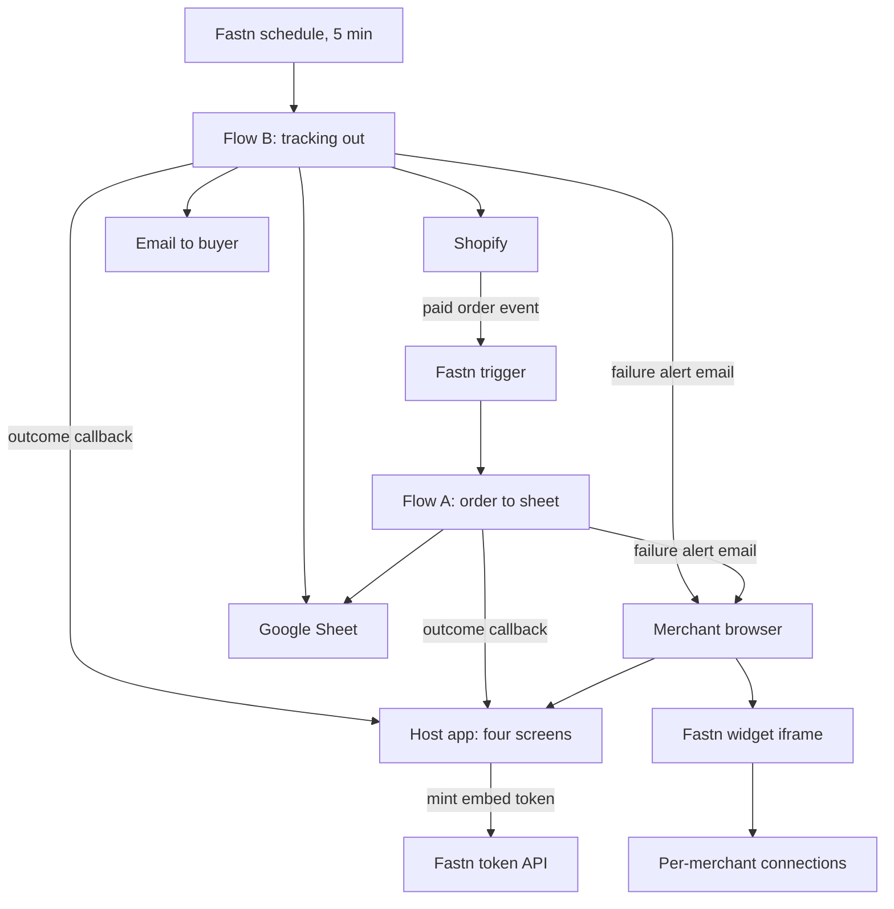

# TRD: Doorstep, technical design on Fastn

2026-09-19 · @Someone

## Overview and scope

Doorstep runs on Fastn: two multi-tenant workflows move orders and tracking between Shopify, a Google Sheet and email, the Fastn widget lets each merchant connect their own accounts, and a small host app we write in React, Tailwind, Node, Express and MongoDB mints embed tokens and shows Sync health. We write only the host app and the workflow logic that Fastn does not generate; Fastn supplies connectors, per-merchant auth, triggers, retries, execution history and alerts.

This document implements the Doorstep PRD for Track 02 of Build with Fastn. It covers architecture, the Fastn capabilities we use, data contracts, workflow design, the host app, and the build and verification plan. Screens, routes and navigation are defined in the App flow document, which the host app section follows.

**In scope.** Flow A (order to sheet), Flow B (tracking to Shopify and buyer), the merchant app shell (Today, Orders, Sync health and Connections), the callback receiver, the failure alert email, reliability controls, and verification evidence.

**Out of scope.** Backfill, multi-store inventory sync, abandoned carts, AI support, reporting, and any second buyer channel unless the email path is done and Twilio's sandbox works within 15 minutes.

**Confidence and sources.** Design choices follow Fastn's V2 documentation and its official integration\_builder skill (v16). Items marked **Verify** depend on the connector catalogue or workspace settings we can only confirm inside our workspace, for example the exact Shopify and Google Sheets action names.

## Architecture

The system has three layers: a host app we own, the Fastn platform that runs the integration, and the merchant's own systems. Fastn sits in the middle and performs every read and write against Shopify, Google Sheets and email on each merchant's behalf.



In plain terms: an order event triggers Flow A, which writes a sheet row; a schedule triggers Flow B, which reads tracking from the sheet and updates Shopify and the buyer; both flows report outcomes to our host app.

**Components.**

| Component | Owner | Responsibility |
| --- | --- | --- |
| Host app (React and Tailwind frontend, Node and Express API, MongoDB) | Us | Serves the app shell, mints embed tokens, embeds the widget, receives callbacks, serves Sync health and Orders |
| Fastn widget | Fastn | Merchant self-service connect and configure, per merchant |
| Fastn connectors and connections | Fastn | Shopify, Google Sheets and email access with per-merchant credentials |
| Flow A and Flow B | Us, generated through the Fastn gateway | Integration logic in Fastn's JavaScript sandbox |
| Triggers | Fastn | Shopify order event (or webhook), 5-minute schedule |
| Config | Fastn | Merchant-editable mappings and filters read on every run |
| Executions, alerts, sync reports | Fastn | Run history, failure notification, per-record diffs |

**Key decisions.**

1. **Multi-tenant from the start (Fastn Path B).** Shopify and the sheet are per-customer connectors; one workflow serves every merchant, resolved by the customer identity on each run.
2. **Two workflows, one execution shape each.** Flow A handles one order event; Flow B handles a batch poll. They are never merged.
3. **Config over code.** Order status filter and sheet tab live in the approved config, so a merchant changes them without a redeploy.
4. **Callbacks, not polling.** Fastn gives no documented way to poll a queued execution id, so each flow reports its own outcome to the host app.

## Fastn technology used

We use fifteen Fastn capabilities, and each one replaces work we would otherwise build and maintain ourselves. This table is also our evidence for the Fastn MCP tool rubric line.

| # | Fastn capability | How we use it in Doorstep | What we avoid building |
| --- | --- | --- | --- |
| 1 | **Connectors and connections** | Shopify, Google Sheets and an email connector (Gmail, SendGrid or Twilio), one connection per merchant per connector | OAuth apps, token refresh, credential storage |
| 2 | **Embedded widget** at User-level scope | Connect your store page: merchants connect and manage their own accounts | A connect UI and a credential vault |
| 3 | **Embed token API** | Our server mints a short-lived token per page load with our API key | Session and identity plumbing for the iframe |
| 4 | **Workflows** (JavaScript sandbox) | Flow A and Flow B, published as immutable snapshots | A hosted worker service and deployment pipeline |
| 5 | **Triggers** | Shopify order app event (fallback: webhook, then schedule) for Flow A; a 5-minute schedule for Flow B | Webhook registration, cron hosting, delivery retries |
| 6 | **Multi-tenancy** (connector scope, installations) | Per-customer connectors flipped to MULTI\_TENANT; one installation per merchant | Per-tenant code paths and data isolation logic |
| 7 | **Dynamic config** (`fastn.config.getByTemplate`) | Merchant-editable mappings and filters read on every run | Config screens and redeploys |
| 8 | **State** (`fastn.state`) | Idempotency keys, order-to-row map and the notified flag; failure records go to our MongoDB through the callback | A separate datastore |
| 9 | **Secrets and env config** | Callback secret in `fastn.secrets`; app base URL in `fastn.envConfig` | Secret handling in code |
| 10 | **Retry policy and deduplication key** | 3 attempts with exponential backoff; the order id as the dedup key; Sequential mode on Flow A | Retry loops (the sandbox has no sleep) |
| 11 | **Executions, Events, Traces and Replay** | Debug every run; replay a failed event after a fix | Custom logging and a dead-letter queue |
| 12 | **Alerts** | Failure alert on any failed run; "broken connectors above 0"; "no runs in 24 hours" on schedules | A monitoring service |
| 13 | **Sync reports** (`fastn.diff.compare`) | Record-by-record diff per run, to show what changed | A reconciliation tool |
| 14 | **Gateway and skills** (mcp.fastn.dev, integration\_builder) | Claude plans, maps, builds, tests, binds triggers, creates the widget and verifies | Hand-writing and hand-testing the integration |
| 15 | **Unified API** (check only) | Look for an ecommerce entity in the catalogue; use it if it covers orders, else per-provider connectors | Per-provider mapping code |

**How the pieces connect.** The gateway builds the workflows, config and widget inside our Fastn workspace. At run time the merchant's widget connections give the flows access to their own Shopify store and sheet. Every run appears in Fastn's execution history and calls back our host app.

**Verify before relying on it.** The exact action names for Shopify orders, fulfillments and Sheets rows come from the connector's action list. Whether the Shopify connector exposes an order-created event decides the trigger type. Whether code editing is enabled in our workspace decides how we make hand fixes.

## Technology stack

Our own code uses React with Tailwind CSS on the front end, Node with Express on the back end, and MongoDB for any data we store ourselves; Fastn runs the integration logic. This split keeps the part we write small and puts everything that touches Shopify, the sheet and email on Fastn.

| Layer | Technology | Role | Notes |
| --- | --- | --- | --- |
| Frontend | React with Tailwind CSS | Connect your store page (widget iframe) and Sync health panel | Built with Vite; Tailwind dark and light themes follow the system setting |
| Backend | Node (20 LTS or newer) with Express | Token minting, callback receiver, Sync health API | JSON body limit 100 KB; secret header check; input validation |
| Database | MongoDB | Everything we store ourselves: customers and sync events | Atlas free tier or a local instance for the demo; **Verify** which we can reach from the venue |
| Integration platform | Fastn | Connectors, connections, workflows, triggers, config, widget, alerts | Built through the Fastn gateway; see Fastn technology used |

**Where data lives.**

| Data | Store | Why there |
| --- | --- | --- |
| Merchant records and the map from our merchant id to the Fastn customer id | MongoDB `customers` | Token minting needs the Fastn customer UUID; we own the merchant |
| Sync outcomes and failures (Sync health, failure log) | MongoDB `syncEvents` | Written by the callback receiver; queryable per merchant |
| Idempotency keys and the notified flag | `fastn.state` | Must be read inside the workflow sandbox, which cannot reach our database |
| Mappings and filters | Fastn config | Merchant-editable in the widget, read on every run |
| Credentials | Fastn connections; secrets in `fastn.secrets` | Never stored in our database |

We do not use `fastn.db`: failure records reach MongoDB through the callback. If our app is down when a flow reports, that record is missing from Sync health but still present in Fastn's execution history, and replay recovers it.

## Data model and contracts

Four contracts hold the design together: the Fulfillment sheet, the approved config, the callback payload, and the idempotency and failure stores. Field names below are our design; the Shopify payload field names are confirmed from a real probe during build.

**Fulfillment sheet (one tab per merchant).**

| Column | Set by | Notes |
| --- | --- | --- |
| order\_id | Flow A | Shopify order id; the natural key for upsert |
| order\_number | Flow A | Human-readable, used in the buyer email |
| created\_at | Flow A | Order time |
| buyer\_name, buyer\_email, buyer\_phone | Flow A | Email is required for notification |
| ship\_address | Flow A | Full shipping address in one cell |
| items | Flow A | SKU, size and quantity per line |
| status | Flow A, Flow B | New, then Notified; Cancelled is a P2 stretch |
| tracking\_number, carrier | Supplier | The only columns a human fills in |
| notified\_at | Flow B | Set with status |

**Config (one template, cloned per merchant).** Read with `fastn.config.getByTemplate(templateId)`. It holds the order-to-row mappings, the conditions (order paid; exclude test orders) and the sheet tab. Matching key is the order id.

**Callback payload** (POST to our host app, header `x-callback-secret`):

```json
{ "customerId": "...", "eventId": "...", "orderId": "...", "orderNumber": "1042",
  "workflow": "orders-to-fulfillment", "outcome": "success | skipped | failed",
  "step": "upsert_row", "errorKind": "connection | data | other", "error": "...",
  "runAt": "2026-09-19T10:41:12Z" }
```

**Idempotency and failure stores.**

| Store | Key or table | Content |
| --- | --- | --- |
| `fastn.state` | `orders-to-fulfillment:{customerId}:{orderId}` | target row id, content hash, last status, processed time |
| `fastn.state` | `tracking-notify:{customerId}:{orderId}` | notified flag, so a retry never emails twice |
| MongoDB collection `syncEvents` | customerId, eventId, orderId, orderNumber, workflow, outcome, step, errorKind, error, at | Failure log and Sync health source; written by the callback receiver; every query filters by customerId and validates its input |

Keys are namespaced by workflow, customer and record because the scope of Fastn state across workflows is not documented precisely. State is written after the side effect, and for the sheet we upsert by order id instead of appending, so a failure between the write and the state update cannot create a duplicate.

**Derived app state.** Order stage and open issues are computed from `syncEvents` at read time, so the only workspace state we store is `customers.status`. The derivation rules and the reasons for `eventId`, `orderNumber` and `errorKind` are in the App flow document.

## Workflow design

Flow A handles one order event and Flow B polls the sheet; each is its own workflow with one execution shape, and both return the same result shape so tests can assert on it.

|  | Flow A: orders-to-fulfillment | Flow B: tracking-to-shopify-and-buyer |
| --- | --- | --- |
| Trigger | Shopify order-paid app event; fallback webhook with dedup key on order id; reconcile schedule as a safety net | Schedule, every 5 minutes |
| Input (`ctx.input`) | The event payload itself, no wrapper | Scope only: optional `limit`, `maxPages` |
| Tier and timeout | Instant or Standard; one record, short | Standard; set `timeoutMs` for the worst case |
| Execution mode | Sequential on the webhook, so one order never races itself | Single run at a time |
| Connectors | Shopify (read), Google Sheets (upsert) | Google Sheets (read, update), Shopify (fulfillment), email |
| Scope per connector | Shopify and Sheets MULTI\_TENANT | Shopify, Sheets and email MULTI\_TENANT |
| Reads config | Yes: conditions and tab, via `getByTemplate` | Yes: tab and status names |

**Flow A steps.**

1. Read the customer id from `ctx.headers['x-end-org-id']` and build the state key.
2. If the key exists and the content hash is unchanged, write state as skipped, report skipped and stop.
3. Apply the config conditions (paid, not a test order); if excluded, report skipped with the reason.
4. Upsert the sheet row by order id: update if it exists, create if not.
5. Write state with the target row id, hash and status after the write, then report success.
6. On any error, catch it, append to `errorDetails`, report failed through the callback with an errorKind so it lands in MongoDB, send one alert email per failing record, and rethrow so retries and alerts see it.

**Flow B steps.**

1. Read rows where tracking\_number is set and status is not Notified.
2. For each row, skip if the notified flag is already in state.
3. Create the Shopify fulfillment with the tracking number and carrier.
4. Email the buyer once.
5. Set the notified flag in state, then set the row to Notified.
6. Catch per record, keep going, report each failure with its errorKind and send the alert email, and return counts.

**Return shape (both flows).** `{ created, updated, skipped, errors, errorDetails }`. A run that failed every record still returns success at the HTTP level, so tests assert on this returned value and on a read-back from Shopify and the sheet, never on a 2xx alone.

**Callback fields and alert email.** Every callback carries `eventId` (built in the flow from the order id, the workflow and the run time), `orderNumber` and `errorKind`. The catch step sets `errorKind` to `connection` for authorization or expired-token errors, `data` for a missing buyer email or address, and `other` otherwise. It then emails the merchant through the email connector with a Fix it link built from the app base URL in `fastn.envConfig`, guarded by a state key so one failing record sends one alert. **Verify** whether the sandbox exposes the retry attempt number, which would let us send only after the last attempt.

**Sandbox rules we design around.** Connector results are unwrapped with `.output`; action arguments are passed directly, not nested under `input`; there are no timers, imports, `Buffer` or `URL`, so retries come from the platform policy and the hash is a small pure-JavaScript function. **Verify:** the tier ceilings differ between Fastn sources (Instant 30 or about 60 seconds), so we design for the tighter one.

## Host app

The host app is a React and Tailwind frontend served by a Node and Express API with MongoDB behind it, and its only jobs are to keep the Fastn API key on the server, embed the widget, and receive and show flow outcomes. Our earlier embed starter is dependency-free Node; we port its logic to Express and rebuild the page in React, and we retest every endpoint against our real Fastn workspace after the port. Routes and screen behaviour follow the App flow document, and its Tier 1 (shell, Sync health, Connections, minimal Today) is built before Orders and onboarding.

**Frontend (React with Tailwind CSS).**

| Component | Behaviour |
| --- | --- |
| `ConnectStore` | Requests `/api/fastn-token`, renders the widget iframe, and mints a fresh token when the widget posts `fastn:session-expired` |
| `SyncHealth` | Polls `/api/sync-events` every 5 seconds; shows Synced, Skipped and Failed counts and the latest 50 events, issues first; opens the event named in the URL; its Fix button links to Connections with focus and returnTo |
| `EventTable` | Failures highlighted with order, step and reason; text rendered as text, never as HTML |
| Styling | Tailwind utility classes, system light and dark theme, visible focus rings, 44 px touch targets |
| AppShell and StatusPill | Four-destination navigation (left rail from 768 px, bottom tab bar below), workspace name, and a pill showing the highest-priority state with a link to its fix; Sync health carries the open-issue badge |
| Today | Status line, issue or reconnect banner, three counts, last 5 events, setup checklist until live; polls every 15 seconds |
| Orders and OrderDrawer (Tier 2) | Stage filter and list; a drawer with the order timeline; filter, drawer and scroll held in the URL |

**Backend (Node with Express).**

| Endpoint | Method | Purpose | Security |
| --- | --- | --- | --- |
| `/api/fastn-token` | GET | Mints an embed token on the server and returns the iframe URL; fresh token every page load | API key in server env; never sent to the browser |
| `/api/sync-events` | POST | Receives flow outcome callbacks and stores them in MongoDB | Shared secret header, constant-time compare; payload validated; 100 KB limit |
| `/api/sync-events` | GET | Counts and last 50 events for one customer, with optional filter=issues and event=\<id> | Filtered by customer id |
| `/api/health` | GET | Liveness check, including a MongoDB ping | None |
| /api/workspace | GET, POST | GET returns status, the derived state and the open-issue count for the status pill; POST sets status to live when Sara confirms setup | Filtered by customer id; POST body validated |
| /api/orders | GET | Tier 2: orders with their derived stage, optional stage filter | Filtered by customer id |

Middleware is `express.json` with the size limit, a route-level rate limit on the callback, and security headers. The merchant is identified by session in production; the demo passes a customer id in the query string.

**MongoDB collections.**

| Collection | Fields | Indexes |
| --- | --- | --- |
| `customers` | name, email, `fastnEndOrgId`, status, shopDomain, sheetUrl, createdAt | Unique on email and on `fastnEndOrgId` |
| `syncEvents` | customerId, eventId, orderId, orderNumber, workflow, outcome, step, errorKind, error, at | Compound on customerId and at (descending); unique on eventId; optional expiry after 30 days |

Every read of `syncEvents` filters by customerId, and the callback rejects a customerId that has no matching `customers` record.

**Token minting.** `POST /api/v1/embed/token` with `Authorization: Bearer <API key>`, the customer's UUID as `endOrgId`, and `x-org-id` when set. The response is parsed for both `data.token` and `token`, because Fastn documents both shapes. A `fsk_test_` key adds the `X-fastn-Test-Mode: true` header and still writes to live systems. The iframe URL takes the token; for user-level embeds it also carries `tenant-id`. **Verify** the host, request and response shape on the workspace's Embed tab.

**Widget behaviour.** The widget's integration scope is set to User level, so each merchant connects their own store and sheet. Refresh is capped at 7 days per session, after which the widget posts `fastn:session-expired`.

**Security rules.**

- The Fastn API key and the MongoDB connection string live only in server environment variables; the key is pinned to the customers it may reach, with the narrowest role that works.
- The callback secret lives in `fastn.secrets` on the Fastn side and in an environment variable on ours; it never appears in the browser or repo.
- Callback data is untrusted: validated on the server, and rendered in React as text.
- MongoDB queries use typed fields from validated input, never raw request objects, to prevent operator injection.
- The callback URL must be publicly reachable from Fastn's runners, so we use a tunnel or a hosted deployment.

## Build, test and verification plan

We build through Claude connected to the Fastn gateway with the integration\_builder skill, because it turns each rubric phrase into an artifact we can screenshot: approvals, a config id, a widget readback and a verification report. We use one builder per use case, since creating a workflow overwrites any existing one with the same name.

| Phase | What happens | Fastn tools involved | Our action |
| --- | --- | --- | --- |
| Prepare | Connections active; test data ready | `get_connect_url`, `list_connections` | Connect Shopify dev store, test sheet, email; create one customer |
| Plan | Discover connectors, check events, recommend a plan | `list_connectors`, `analyze_entities`, `get_connector_events`, `list_unified_categories` | Answer business questions; tenancy: customers, multi-tenant |
| Map | Probe real fields, propose mappings and conditions | `probe_connector`, `propose_configuration`, `check_config_status` | Approve the mapping page; note the config id |
| Test gate | Derive acceptance cases | `submit_test_cases` | Approve the case set; ask for the small band (about 15 to 25) |
| Build | Probe every action, create flows, set scope | `run_code`, `create_workflow`, `set_connector_scope`, `test_workflow` | Confirm before any live write beyond one record |
| Trigger and widget | Bind triggers and create the widget | `bind_app_event_trigger` or webhook, `bind_schedule_trigger`, `create_widget` | Confirm the schedule (every 5 minutes) |
| Verify | Fire each trigger, correlate executions, check parity | `trigger_scheduler_now`, `list_executions`, `get_widget` | Read the verification report; paste it into the submission |

Tool names come from the official skills at the versions we read (integration\_builder v16, workflow\_verifier v2). We confirm them against the tools the gateway lists in our session.

**Acceptance suite.** Nine tests T1 to T9 from the PRD run as attached test cases, with mock cases for logic breadth and live cases only where a real write must be proven, each with a read-back from Shopify or the sheet. The kill-matrix checks that apply: field-exact values, filter pass and skip pair, idempotent re-run, update does not re-create, and the trigger-fire case with an event shaped exactly like the payload schema.

**Regression rule.** After any edit to a workflow, config or connector action, the full case set for that flow runs again and results are saved; "edited" never means "done".

**Fallback build path.** If the gateway is blocked, the dashboard Platform Agent builds the same design from the prompts in our prompt library, and we screenshot its plan, progress and diagnosis instead.

**Evidence we collect.** Screenshots of the mapping and test-case approval pages, the config id, the widget readback, one failed run debugged from execution detail, the alert configuration, the sync report, and the final verification report.

**Host app build order.** Tier 1 first (shell and status pill, Sync health, Connections with `focus` and `returnTo`, minimal Today, the callback receiver with the new fields), then Tier 2 (Orders and the drawer), then Tier 3 (Welcome, Setup, Rules), as defined in the App flow document. Navigation tests N1 to N7 run alongside T1 to T9, and none of Tier 2 or 3 starts before T1 to T9 pass.

## Non-functional requirements, risks and decisions

The design targets a correct, duplicate-free loop with visible failures, and the numbers below are our own acceptance targets on the demo store, not measured yet.

| Area | Requirement | How Fastn or our design meets it |
| --- | --- | --- |
| Latency | Order to row under 60 s; tracking to Notified under 5 min | Event trigger for Flow A; 5-minute schedule for Flow B |
| Correctness | 0 duplicate rows or emails | Dedup key, state guard, upsert by order id, notified flag |
| Observability | 0 silent failures | Executions, Traces, callbacks stored in MongoDB `syncEvents`, alerts |
| Isolation | No cross-merchant data | MULTI\_TENANT scope, `getByTemplate`, customer column on every query |
| Security | No key or secret in the browser | Server-side token minting, Fastn secrets, constant-time secret check |
| Recoverability | Any failed order can be re-run | Replay from Events; idempotent flows |
| Cost | Stay inside workspace credits and limits | Check Billing before the build; bounded test runs only |

**Technical risks.**

| Risk | Effect | Mitigation |
| --- | --- | --- |
| Shopify connector lacks a fulfillment action | Flow B cannot write back | Fallback: update sheet status and email the buyer; or add the action with the connector-builder skill only if time allows |
| App event subscription fails or needs manual registration | Flow A never fires | Retry once; use a webhook with a dedup key; then a schedule poll |
| State written before side effect, or after a failure | Duplicate or skipped orders | Write state after the side effect; upsert by key; run the replay test |
| Tier or timeout ceilings differ between Fastn sources | Timeouts on multi-call runs | Standard tier, explicit `timeoutMs`, bounded loops |
| Auth method rotation on connector builds | Orphaned connections | Run all batch action builds before merchants connect |
| Host app shell grows past the build window | Fastn flows and verification are starved of time | Tier 1 only until T1 to T9 pass; Orders and onboarding are cut first |

**Decisions to confirm with a mentor or in our workspace.**

- [ ] Does the workspace's gateway skill library match integration\_builder v16, and is the Fastn MCP tool the judges score the gateway path?
- [ ] Does the Shopify connector list an order-created event and a fulfillment action, and what are their exact names?
- [ ] Is a unified ecommerce entity available, so the widget can be unified instead of per-provider?
- [ ] Is code editing enabled, or do all fixes go through the agent?
- [ ] Which email connector is active: Gmail, SendGrid or Twilio?
